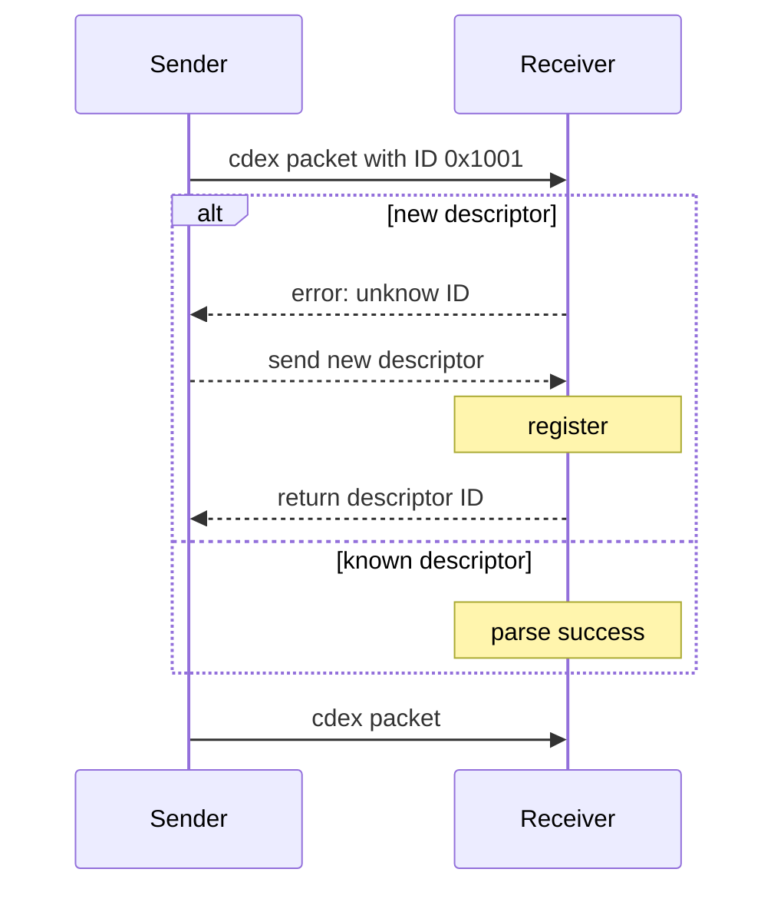

# Overview

CDEX（/ˈsiːˌdeks/）即 Compact Data Exchange，是一个纯 C 实现的自定义通信协议，目标是实现高效、紧凑、灵活、可扩展的数据编码，可用于 LoraWAN、Zigbee、BLE 等低速链路的批量数据传输。
## Feature

CDEX 通过引入 **Descriptor** 描述数据的元信息、**DataMask** 匹配数据的位置信息，实现了比 TLV 更高的编码效率、比位置硬编码更高的灵活性和扩展性。

1. 批量传输小数据时，效率远高于 TLV
2. 支持 varint 整数动态压缩编码
3. 支持 string 和 binary 不定长数据
4. 支持与 JSON 的相互转换
5. 允许不修改代码进行动态扩展、支持新格式

## Format

一个有效的 CDEX 包由如下部分组成：

| Field         | Length    | Description      |
| ------------- | --------- | ---------------- |
| Descriptor ID | 2 bytes   | 数据包对应的描述符 ID     |
| DataMask      | 1~8 bytes | 用于匹配数据位置的 Bitmap |
| Payload       | Variable  | 多个数据字段值的编码       |
| Checksum      | 2 bytes   | CRC16 校验和        |

### Descriptor ID

CDEX 的 **Descriptor** 是关于数据包字段顺序和编码方式的描述，形式上是一个很长的 **描述字符串**，包含了用 `,` 号分隔的最多 64 个段，例如 *"temp:f32,humidity:u16,pressure:u32"*，每一个段形式上都是 *"字段名称:传输值类型"*，可以方便地保存在一个 CSV 文件中，易于查看、交换、在编解码端保持一致。

*传输值类型* 是一个简短的表示数据编码格式的字符串，可选值包括：`u8`、`i8`、`u16`、`i16`、`u32`、`i32`、`u64`、`i64`、`num`、`f32`、`d64`、`bin`、`str`。

每一个 **Descriptor** 的 ID 可以是 CSV 的行号，也可以是一个自定义的值，编解码方保持一致即可，使用时可以硬编码到代码中，也可以动态地从 CSV 文件解析。

### DataMask

指示当前数据包中存在哪些数据，长度取决于 **描述字符串** 中段的数量，最多 64 bits，从低到高位与 **描述字符串** 中的段按顺序一一对应，如果 **DataMask** 中的第 N 位被置 1，则描述字符串中第 N 个数据段存在。

**DataMask** 长度为 1 ~ 8 Bytes，例如，当 **描述字符串** 中有 34 个段时，**DataMask** 为 40 bits，有 3 个段时则为 8 bits。

### Payload

实际的数据字段值，需要结合 **BitMap** 和 **描述字符串** 进行解析和转换，例如，**Bitmap** 为 0b0010'0110 时，Data List 中的第 1 个数据需要按 **描述字符串** 的第 2 个段进行解析，第 2 个数据按第 3 个段解析、第 3 个数据则按第 6 个段解析。


# Usage

## 描述符管理

描述符可以使用 **描述字符串** 进行注册，也可以从结构体数组中加载，前者更灵活，后者则速度更快、有利于缩短初始化时间。

使用 **描述字符串** 进行注册时，**描述字符串** 可以预定义并硬编码到代码里，也可以在运行时动态获取，可以保留 ID 中某个位进行区分，例如，可以使预定义的描述字符串的 ID 最高位始终为 0，而动态创建的 ID 最高位则为 1。

```c
/* register from string */
const char* sensor_desc_str = "temp:f32,humidity:u16,pressure:u32,status:u8,device_name:str";
cdex_status_t reg_status = cdex_descriptor_register(0x8001, sensor_desc_str);
if (reg_status == CDEX_SUCCESS) {
    printf("Successfully registered descriptor ID 0x8001 from string.\n");
} else {
    printf("Failed to register descriptor 1001. Error: %d\n", reg_status);
    return -1;
}

/* load from structure array */
cdex_field_t power_fields[] = {
	{"voltage", CDEX_TYPE_I16, 2},
	{"current", CDEX_TYPE_I16, 2},
	{"power", CDEX_TYPE_F32, 4},
	{"error_code", CDEX_TYPE_U32, 4},
	{"uptime", CDEX_TYPE_U64, 8}
};
int power_field_count = sizeof(power_fields) / sizeof(power_fields[0]);
cdex_status_t load_status = cdex_descriptor_load(0x0001, power_fields, power_field_count);
if (load_status == CDEX_SUCCESS) {
	printf("Successfully loaded descriptor ID 0x0001 from struct array.\n");
} else {
	printf("Failed to load descriptor 2005. Error: %d\n", load_status);
	return -1;
}
```


### 动态获取

为了实现描述符的动态获取，需要在传输双方之间实现如下接口：

- **返回解析错误**：让发送方能发现异常，进而更新描述符
- **发送新描述符**：由发送方提供，保证双方一致
- **返回描述符ID**：由接收方注册描述符后返回给发送方




## 编码

```c
cdex_packet_t packet_to_pack;
cdex_value_t val;

cdex_packet_init(&packet_to_pack, 0x0001);

val.f32 = 16.125f;
cdex_packet_push(&packet_to_pack, 0, val);
val.str = "Sensor_A";
cdex_packet_push(&packet_to_pack, 4, val);

print_packet_details(&packet_to_pack);

uint8_t buffer[128];
int packed_len = cdex_pack(&packet_to_pack, buffer, sizeof(buffer));
if (packed_len > 0) {
	print_hex("Packed CDE Data", buffer, packed_len);
} else {
	printf("Packing failed!\n");
	cdex_manager_cleanup();
	return -1;
}
```

## 解码

```c
cdex_packet_t parsed_packet;
cdex_status_t parse_status = cdex_parse(buffer, packed_len, &parsed_packet);
if (parse_status == CDEX_SUCCESS) {
	cJSON* json_obj = cdex_packet_to_json(&parsed_packet);
	char* json_string = cJSON_Print(json_obj);
	printf("Parsed and converted to JSON:\n%s\n", json_string);
	
	free(json_string);
	cJSON_Delete(json_obj);
	cdex_free_packet_memory(&parsed_packet);
} else {
	printf("Parsing failed with code %d\n", parse_status);
}
```

